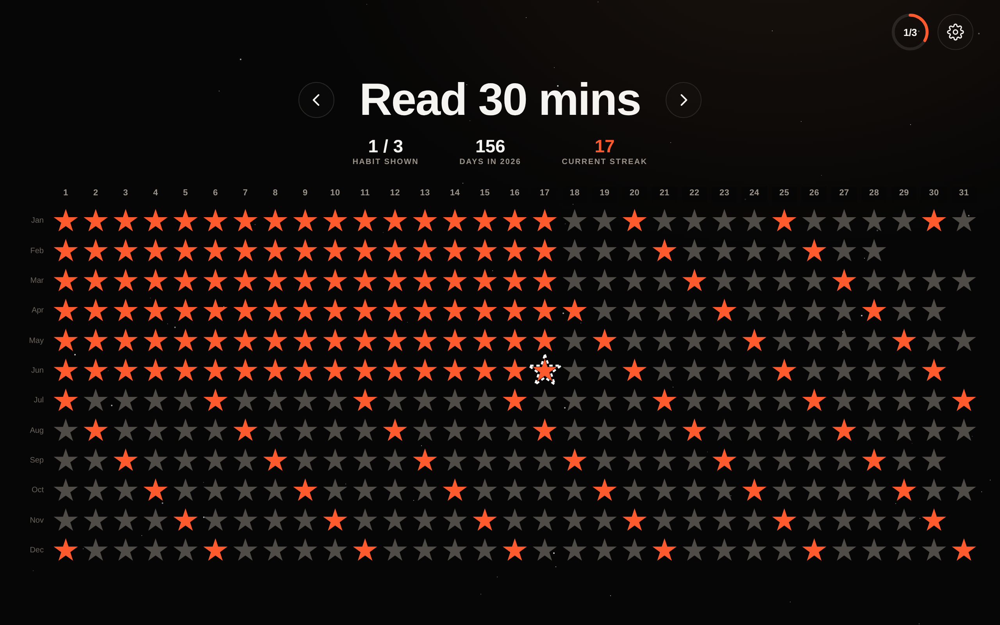

# Good Habits ⭐

**Light up a star for every day you keep a habit.** A simple, beautiful habit
tracker — free, private (everything saves right in your browser), and open
source. → **[habit.nathantowianski.com](https://habit.nathantowianski.com)**

Inspired by Simone Giertz's *Every Day Calendar*. Pick your habits and light up
a star for every day you keep them; over a year the stars paint a picture of
your consistency. A daily ring tracks all your habits at once and celebrates
when you finish them for the day. No account, no tracking, no servers.



## What it does

- **A star for every day of the year.** Tap a star to mark the habit done that
  day; tap again to undo. Today's star is highlighted white until you complete it.
- **Vertical or horizontal layout.** Flip the calendar in Settings — *vertical*
  (months across the top) suits tall/portrait screens, *horizontal* (the whole
  year laid out wide) suits laptops and monitors. It defaults to match your
  screen's shape.
- **Flip between habits** with the `‹` / `›` arrows (or the left/right keyboard
  arrows on a computer).
- **Daily progress ring.** The ring in the corner shows how many of your habits
  you've completed *today* (e.g. `3/4`). Every tap gives it a satisfying pop.
- **Calendar light shows.** Completing a day plays a quick animation across the
  star grid, themed to the habit's name — water rises for "drink water", an
  equalizer bounces for "music", a runner dashes for "exercise", and so on.
  Finish every habit for the day and the whole calendar erupts in a celebratory
  finale. 🎉 (Respects `prefers-reduced-motion`.)
- **At-a-glance stats** under the title: which habit you're viewing (`1 / 3`),
  how many days you've logged this year, and your current streak. A short
  legend explains them on first visit.
- **Settings** (the gear icon, or tap the habit's name) let you:
  - Add and rename habits.
  - Reorder them (drag the handle, or use the up/down arrows) — this sets the
    order you flip through them.
  - Delete a habit, with a confirmation step so you never lose one by accident.
  - Switch years with the `‹ 2026 ›` control (plus a "This year" shortcut).
  - Toggle the calendar direction, and lock past days from editing (so you
    only check off today).
  - **Download a backup** of all your habits and history, and **restore** one
    later — handy for moving between devices or browsers.
  - An **About** section with credits and a link to this open-source repo.
- **Works on any device** — phone, tablet, or desktop — and **saves to your
  browser** (via `localStorage`), so there's nothing to sign up for.

## Running it

It's a static site with no build step and no dependencies.

**Easiest:** just open `index.html` in any modern browser.

**Or serve it locally** (recommended so the web font loads):

```bash
npx serve .
# or
python3 -m http.server 8000
```

then open the printed URL.

**Or host it anywhere static** — Vercel, Netlify, GitHub Pages, etc. It's just
static files, so no build step or framework preset is needed.

> **Hosting on Vercel:** import the repo as a static project (Framework preset:
> *Other*, no build command, output = repo root) and add the custom domain
> **`habit.nathantowianski.com`** in the Vercel dashboard. Vercel automatically
> serves `404.html` for unknown routes. The absolute Open Graph / Twitter URLs
> and canonical link in `index.html` point at that domain so links unfurl
> nicely in iMessage, Slack, etc. — update them if you change domains.

## Files

| File | Purpose |
| --- | --- |
| `index.html` | Page structure + share/meta tags |
| `styles.css` | All styling and animations |
| `app.js` | App logic and local storage (no frameworks) |
| `404.html` | On-brand not-found page (served automatically by Vercel) |
| `favicon.svg`, `apple-touch-icon.png` | Icons |
| `og-image.png` | Social share image |

## A note on your data

Everything lives in your browser under the key `goodhabits.v1`. Clearing your
browser data, or using a different browser/device, starts fresh — so use
**Download backup** in Settings if you want a copy. Because it's local-first,
your habit history never leaves your machine unless you export it.

## License

[MIT](LICENSE) © Nathan Towianski. Free to use, modify, and share.
