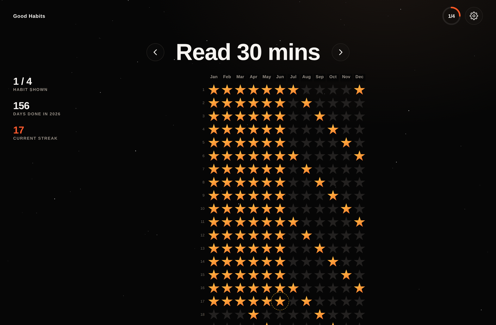

# Good Habits ⭐

A simple, beautiful habit tracker inspired by Simone Giertz's *Every Day Calendar*.

Pick a habit, then light up a star for every day you keep it. Over a year, the
stars paint a picture of your consistency. No accounts, no servers — everything
saves right in your browser.



## What it does

- **A star for every day of the year.** Tap a star to mark the habit done that
  day; tap again to undo. Today is highlighted with a gentle dashed ring.
- **Flip between habits** with the `‹` / `›` arrows (or the left/right keyboard
  arrows on a computer).
- **Daily progress ring.** The ring in the corner shows how many of your habits
  you've completed *today* (e.g. `3/4`). Every tap gives it a satisfying pop.
- **Golden celebration.** Finish *all* your habits for the day and the ring turns
  gold and shimmers, with a burst of confetti. 🎉
- **At-a-glance stats** sit beside the calendar: which habit you're viewing
  (`1 / 4`), how many days you've logged this year, and your current streak.
- **Settings** (the gear icon, or tap the habit's name) let you:
  - Add a new habit.
  - Rename any habit.
  - Reorder them (drag the handle, or use the up/down arrows) — this sets the
    order you flip through them.
  - Delete a habit, with a confirmation step so you never lose one by accident.
  - **Switch years** with the `‹ 2026 ›` control (plus a "This year" shortcut)
    to look back or plan ahead.
- **Works on any device** — phone, tablet, or desktop — and **saves to your
  browser** (via `localStorage`), so there's nothing to sign up for.

## Running it

It's a static site with no build step and no dependencies.

**Easiest:** just open `index.html` in any modern browser.

**Or serve it locally** (recommended so the web font loads):

```bash
npx serve .
# or
python3 -m http.server 8000
```

then open the printed URL.

**Or host it anywhere static** — GitHub Pages, Netlify, Vercel, etc. Push this
folder and point the host at `index.html`.

## Files

| File | Purpose |
| --- | --- |
| `index.html` | Page structure |
| `styles.css` | All styling and animations |
| `app.js` | App logic and local storage (no frameworks) |

## A note on your data

Everything lives in your browser under the key `goodhabits.v1`. Clearing your
browser data, or using a different browser/device, starts fresh. Because it's
local-first, your habit history never leaves your machine.
